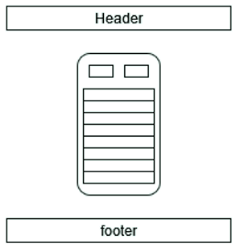

## Sprendžiamo uždavinio aprašymas

### Sistemos paskirtis

Projekto tikslas yra sutelkti visų vykdančių veiklą šaudyklų teikiamas paslaugas į vieną sistemą, tokiu būdu palengvinant klientams teikiamų paslaugų palyginimą bei užsisakymą.

Sistema sudaryta iš dviejų dalių – internetinės aplikacijos, bei aplikacijų programavimo sąsajos, komunikuojančios su duomenų baze.

Šaudyklų klientams platforma leis peržiūrėti informaciją apie šaudyklas, šių siūlomus ginklus ir instruktorius. Klientams registracijos ir prisijungimo nėra. Įmonių vadovai galės registruotis ir prisijungti prie sistemos, valdyti informaciją apie savo filialus. Administratorius tvirtins registracijas ir valdys įmones. Taip pat turės galimybę valdyti ir filialus, bei jų informaciją.
 ## **Funkciniai reikalavimai**
   Klientas galės:

- Peržiūrėti visas šaudyklas;
- Peržiūrėti visas įmones;
- Peržiūrėti visus siūlomus pabandymui ginklus;
- Peržiūrėti dirbančius instruktorius;

Įmonės vadovas galės:

- Užsiregistruoti ir prisijungti;
- Redaguoti savo įmonę;
- Pridėti ir šalinti šaudyklas;
- Keisti šaudyklų informaciją;
- Pridėti ir šalinti šaudyklose esančius ginklus;
- Keisti turimų ginklų informaciją;
- Pridėti ir šalinti šaudyklose dirbančius instruktorius;
- Keisti įmonėje dirbančių instruktorių informaciją.

Sistemos administratorius galės:

- Patvirtinti registracijas;
- Pridėti ir šalinti įmones;
- Keisti įmonių informaciją;
- Valdyti šaudyklas, ginklus, instruktorius taip pat, kaip ir įmonių vadovai.

 # **Sistemos architektūra**
   Sistema išskirstyta į dvi dalis – klientinę dalį ir serverio dalį. Klientinė dalis bus realizuota naudojant „React.js“. Serverio dalis – su „Java“ programavimo kalbai skirtu „Spring“ karkasu, bei „MySQL“ duomenų baze.

# Naudotojo sąsaja

## Naudotojo sąsajos projektas

Žemiau yra pateikiama suprojektuota naudotojo sąsaja. Ją sudaro šie langai:

- Prisijungimo langas;
- Registracijos langas;
- Pagrindinis langas;
- Esybių sąrašo langas;
- Konkrečios esybės langas.

 ## **Naudotojo sąsajos realizacija**
   Realizuotoje naudotojo sąsajoje yra šie langai:

- Prisijungimo langas;
- Registracijos langas;
- Pagrindinis langas;
- Įmonių langas;
- Naujos įmonės modalas;
- Įmonės redagavimo modalas;
- Konkrečios įmonės langas;
- Ginklų langas;
- Naujo ginklo modalas;
- Ginklo redagavimo modalas;
- Konkretaus ginklo langas;
- Šaudyklų langas;
- Naujos šaudyklos modalas;
- Šaudyklos redagavimo modalas;
- Konkrečios šaudyklos langas;
- Instruktorių langas;
- Naujo instruktoriaus modalas;
- Instruktoriaus redagavimo modalas;
- Konkretaus instruktoriaus langas.

 

 # **API specifikacija**
- Atsako formatas: JSON;
- Užklausų kiekis: neribojamas.
   ## **Autorizacijos API metodai**
     Žemiau yra pateikiami API metodai susiję su autorizacija .

|API metodas:|POST|
| - | - |
|Paskirtis:|Prisiregistruoti|
|Pasiekiama per:|api/v1/auth/register|
|Užklausos „header“ dali:|-|
|Užklausos struktūra:|
{

`	`"name": "t",

`	`"surname": "t",

`	`"email" : "t@email.cin",

`	`"password": "t"

}
|
|Atsakymo struktūra:|
{

`	`"access\_token": "{token}",

`	`"refresh\_token": "{token}"

}
|
|Galimi atsako kodai:|
- 200 (OK)

- 422 (Unprocessable Entity) – blogi naudotojo duomenys.
|

|API metodas:|POST|
| - | - |
|Paskirtis:|Prisijungti|
|Pasiekiama per:|api/v1/auth/authenticate|
|Užklausos „header“ dalis:|-|
|Užklausos struktūra:|
{

`	`"email" : "admin@email.cin",

`	`"password": "admin"

}
|
|Atsakymo struktūra:|
{

`	`"access\_token": "{token}",

`	`"refresh\_token": "{token}"

}
|
|Galimi atsako kodai:|
- 200 (OK)

- 403 (Forbidden) – blogi prisijungimo duomenys.
|

|API metodas:|POST|
| - | - |
|Paskirtis:|Atsijungti|
|Pasiekiama per:|api/v1/auth/logout|
|Užklausos „header“ dalis:|Authorization: bearer {token}|
|Užklausos struktūra:|-|
|Atsakymo struktūra:|-|
|Galimi atsako kodai:|- 200 (OK)|

|API metodas:|POST|
| - | - |
|Paskirtis:|Atnaujinti JWT žėtoną|
|Pasiekiama per:|api/v1/auth/refresh|
|Užklausos „header“ dalis:|Authorization: bearer {token}|
|Užklausos struktūra:||
|Atsakymo struktūra:|
{

`	`"access\_token": "{token}",

`	`"refresh\_token": "{token}"

}
|
|Galimi atsako kodai:|
- 200 (OK)

- 403 (Forbidden) – blogas „refresh“ žėtonas.
|

 ## **Įmonių API metodai**
   Žemiau yra pateikiami API metodai susiję su įmonės esybe.

|API metodas:|GET|
| - | - |
|Paskirtis:|Gauti visų įmonių sąrašą|
|Pasiekiama per:|api/v1/companies|
|Užklausos „header“ dalis:|-|
|Užklausos struktūra:|-|
|Atsakymo struktūra:|
[

`	`{

`		`"id": 1,

`		`"name": "UAB KBc",

`		`"address": "Baršausko g. 11",

`		`"postalCode": "LT-15151",

`		`"city": "Kaunas",

`		`"phoneNumber": "+37060253697",

`		`"email": "kb@gmail.com",

`		`"website": "https://kb.ly",

`		`"fk\_user": {

`			`"name": "user",

`			`"surname": "user"

`		`},

`		`"approved": true

`	`},

`	`{

`		`"id": 8,

`		`"name": "Šaudymo klubas",

`		`"address": "Taikos pr. 123",

`		`"postalCode": "LT-52528",

`		`"city": "Kaunas",

`		`"phoneNumber": "+37067985279",

`		`"email": "sklubas@gmail.com",

`		`"website": "",

`		`"fk\_user": {

`			`"name": "user",

`			`"surname": "user"

`		`},

`		`"approved": false

`	`}

]
|
|Galimi atsako kodai:|- 200 (OK)|

|API metodas:|GET|
| - | - |
|Paskirtis:|Gauti įmonės ginklų sąrašą|
|Pasiekiama per:|api/v1/companies/{id}/firearms|
|Užklausos „header“ dalis:|-|
|Užklausos struktūra:|-|
|Atsakymo struktūra:|
[

`	`{

`		`"id": 1,

`		`"manufacturer": "IMI",

`		`"model": "Desert Eagle",

`		`"caliber": ".50AE",

`		`"price": 0.5,

`		`"fk\_shootingRange": {

`			`"id": 1,

`			`"address": "Barsausko g. 5",

`			`"city": "Kaunas",

`			`"fk\_company": {

`				`"id": 1,

`				`"name": "UAB KBc"

`			`}

`		`},

`		`"picture": "https://www.drummencustomguns.com/5578-medium\_default/magnum-research-desert-eagle-44-mag-brushed-chrome.jpg"

`	`}

]
|
|Galimi atsako kodai:|
- 200 (OK)

- 404 (Not Found) – blogas įmonės „id“.
|

|API metodas:|GET|
| - | - |
|Paskirtis:|Gauti įmonės instruktorių sąrašą|
|Pasiekiama per:|api/v1/companies/{id}/instructors|
|Užklausos „header“ dalis:|-|
|Užklausos struktūra:|-|
|Atsakymo struktūra:|
[

`	`{

`		`"id": 1,

`		`"name": "Tadas",

`		`"surname": "Špokevičius",

`		`"fk\_shootingRange": {

`			`"id": 1,

`			`"address": "Barsausko g. 5",

`			`"city": "Kaunas",

`			`"fk\_company": {

`				`"id": 1,

`				`"name": "UAB KBc"

`			`}

`		`}

`	`},

`	`{

`		`"id": 2,

`		`"name": "Nedas",

`		`"surname": "Barkauskas",

`		`"fk\_shootingRange": {

`			`"id": 1,

`			`"address": "Barsausko g. 5",

`			`"city": "Kaunas",

`			`"fk\_company": {

`				`"id": 1,

`				`"name": "UAB KBc"

`			`}

`		`}

`	`}

]
|
|Galimi atsako kodai:|
- 200 (OK)

- 404 (Not Found) – blogas įmonės „id“.
|

|API metodas:|GET|
| - | - |
|Paskirtis:|Gauti įmonės informaciją|
|Pasiekiama per:|api/v1/companies/{id}|
|Užklausos „header“ dalis:|-|
|Užklausos struktūra:|-|
|Atsakymo struktūra:|
{

`	`"id": 8,

`	`"name": "Šaudymo klubas",

`	`"address": "Taikos pr. 123",

`	`"postalCode": "LT-52528",

`	`"city": "Kaunas",

`	`"phoneNumber": "+37067985279",

`	`"email": "sklubas@gmail.com",

`	`"website": "",

`	`"fk\_user": {

`		`"name": "user",

`		`"surname": "user"

`	`},

`	`"approved": false

}
|
|Galimi atsako kodai:|
- 200 (OK)

- 404 (Not Found) – blogas įmonės „id“.
|

|API metodas:|POST|
| - | - |
|Paskirtis:|Sukurti naują įmonę|
|Pasiekiama per:|api/v1/companies|
|Užklausos „header“ dalis:|Authorization: bearer {token}|
|Užklausos struktūra:|
{

`	`"name": "Šaudymo klubas",

`	`"address": "Taikos pr. 123",

`	`"city": "Kaunas",

`	`"phoneNumber": "+37067985279",

`	`"postalCode": "LT-52528",

`	`"website": "",

`	`"email": "sklubas@gmail.com",

`	`"fk\_user": 5

}
|
|Atsakymo struktūra:|
{

`	`"id": 8,

`	`"name": "Šaudymo klubas",

`	`"address": "Taikos pr. 123",

`	`"postalCode": "LT-52528",

`	`"city": "Kaunas",

`	`"phoneNumber": "+37067985279",

`	`"email": "sklubas@gmail.com",

`	`"website": "",

`	`"fk\_user": {

`		`"name": "user",

`		`"surname": "user"

`	`},

`	`"approved": true

}
|
|Galimi atsako kodai:|
- 201 (Created)

- 403 (Forbidden) – Draudžiama prieiga.

- 422 (Unprocessable Entity) – nekorektiški įmonės duomenys.
|

|API metodas:|PATCH|
| - | - |
|Paskirtis:|Redaguoti įmonės duomenis|
|Pasiekiama per:|api/v1/companies/{id}|
|Užklausos „header“ dalis:|Authorization: bearer {token}|
|Užklausos struktūra:|
{

`	`"name": "Šaudymo klubas",

`	`"address": "Taikos pr. 123",

`	`"city": "Kaunas",

`	`"phoneNumber": "+37067985279",

`	`"postalCode": "LT-52528",

`	`"website": "",

`	`"email": "sklubas@gmail.com",

`	`"fk\_user": 5

}
|
|Atsakymo struktūra:|
{

`	`"id": 8,

`	`"name": "Šaudymo klubas",

`	`"address": "Taikos pr. 123",

`	`"postalCode": "LT-52528",

`	`"city": "Kaunas",

`	`"phoneNumber": "+37067985279",

`	`"email": "sklubas@gmail.com",

`	`"website": "",

`	`"fk\_user": {

`		`"name": "user",

`		`"surname": "user"

`	`},

`	`"approved": true

}
|
|Galimi atsako kodai:|
- 201 (Created)

- 403 (Forbidden) – draudžiama prieiga.

- 404 (Not Found) – blogas įmonės „id“.

- 422 (Unprocessable Entity) – nekorektiški įmonės duomenys.
|

|API metodas:|DELETE|
| - | - |
|Paskirtis:|Pašalinti įmonę|
|Pasiekiama per:|api/v1/companies/{id}|
|Užklausos „header“ dalis:|Authorization: bearer {token}|
|Užklausos struktūra:|-|
|Atsakymo struktūra:|-|
|Galimi atsako kodai:|
- 204 (No Content)

- 403 (Forbidden) – draudžiama prieiga.

- 404 (Not Found) – blogas įmonės „id“.

- 409 (Conflict) – Negalima pašalinti, nes kiti duomenys įtraukia šią įmonę kaip išorinį raktą.
|

 ## **Šaudyklų API metodai**
   Žemiau yra pateikiami API metodai susiję su šaudyklos esybe.

|API metodas:|GET|
| - | - |
|Paskirtis:|Gauti visų šaudyklų sąrašą|
|Pasiekiama per:|api/v1/shootingRanges|
|Užklausos „header“ dalis:|-|
|Užklausos struktūra:|-|
|Atsakymo struktūra:|
[

`	`{

`		`"id": 1,

`		`"address": "Barsausko g. 5",

`		`"city": "Kaunas",

`		`"price": 0.08,

`		`"maxShooters": 2,

`		`"fk\_company": {

`			`"id": 1,

`			`"name": "UAB dddd"

`		`},

`		`"fk\_hours": {

`			`"monOpen": "09:02:00",

`			`"monClose": "21:05:00",

`			`"tueOpen": null,

`			`"tueClose": null,

`			`"wedOpen": null,

`			`"wedClose": null,

`			`"thurOpen": null,

`			`"thurClose": null,

`			`"friOpen": null,

`			`"friClose": null,

`			`"satOpen": null,

`			`"satClose": null,

`			`"sunOpen": null,

`			`"sunClose": null

`		`},

`		`"outdoor": true

`	`}

]
|
|Galimi atsako kodai:|- 200 (OK)|

|API metodas:|GET|
| - | - |
|Paskirtis:|Gauti šaudyklos informaciją|
|Pasiekiama per:|api/v1/shootingRanges/{id}|
|Užklausos „header“ dalis:|-|
|Užklausos struktūra:|-|
|Atsakymo struktūra:|
{

`	`"id": 1,

`	`"address": "Barsausko g. 5",

`	`"city": "Kaunas",

`	`"price": 0.08,

`	`"maxShooters": 2,

`	`"fk\_company": {

`		`"id": 1,

`		`"name": "UAB KBc"

`	`},

`	`"fk\_hours": {

`		`"monOpen": "09:02:00",

`		`"monClose": "21:05:00",

`		`"tueOpen": null,

`		`"tueClose": null,

`		`"wedOpen": null,

`		`"wedClose": null,

`		`"thurOpen": null,

`		`"thurClose": null,

`		`"friOpen": null,

`		`"friClose": null,

`		`"satOpen": null,

`		`"satClose": null,

`		`"sunOpen": null,

`		`"sunClose": null

`	`},

`	`"outdoor": true

}
|
|Galimi atsako kodai:|
- 200 (OK)

- 404 (Not Found) – blogas šaudyklos „id“.
|

|API metodas:|POST|
| - | - |
|Paskirtis:|Sukurti naują šaudyką|
|Pasiekiama per:|api/v1/shootingRanges|
|Užklausos „header“ dalis:|Authorization: bearer {token}|
|Užklausos struktūra:|
{

`	`"address": "Baltų pr. 19",

`	`"city": "Kaunas",

`	`"price": "10",

`	`"maxShooters": 2,

`	`"isOutdoor": true,

`	`"fk\_company": 4,

`	`"monOpen": "09:00",

`	`"monClose": "16:00",

`	`"tueOpen": null,

`	`"tueClose": null,

`	`"wedClose": "16:00",

`	`"wedOpen": "09:00",

`	`"thurClose": "16:00",

`	`"thurOpen": "09:00",

`	`"friClose": "16:00",

`	`"friOpen": "09:00",

`	`"satClose": "16:00",

`	`"satOpen": "09:00",

`	`"sunClose": "16:00",

`	`"sunOpen": "09:00"

}
|
|Atsakymo struktūra:|
{

`	`"id": 4,

`	`"address": "Baltų pr. 19",

`	`"city": "Kaunas",

`	`"price": 10.0,

`	`"maxShooters": 2,

`	`"fk\_company": {

`		`"id": 1,

`		`"name": "UAB dddd"

`	`},

`	`"fk\_hours": {

`		`"monOpen": "09:00:00",

`		`"monClose": "16:00:00",

`		`"tueOpen": null,

`		`"tueClose": null,

`		`"wedOpen": "09:00:00",

`		`"wedClose": "16:00:00",

`		`"thurOpen": "09:00:00",

`		`"thurClose": "16:00:00",

`		`"friOpen": "09:00:00",

`		`"friClose": "16:00:00",

`		`"satOpen": "09:00:00",

`		`"satClose": "16:00:00",

`		`"sunOpen": "09:00:00",

`		`"sunClose": "16:00:00"

`	`},

`	`"outdoor": true

}
|
|Galimi atsako kodai:|
- 201 (Created)

- 403 (Forbidden) – Draudžiama prieiga.

- 422 (Unprocessable Entity) – nekorektiški šaudyklos duomenys.
|

|API metodas:|PATCH|
| - | - |
|Paskirtis:|Redaguoti šaudyklos duomenis|
|Pasiekiama per:|api/v1/shootingRanges/{id}|
|Užklausos „header“ dalis:|Authorization: bearer {token}|
|Užklausos struktūra:|
{

`	`"address": "Baltų pr. 19",

`	`"city": "Kaunas",

`	`"price": "10",

`	`"maxShooters": 2,

`	`"isOutdoor": true,

`	`"fk\_company": 4,

`	`"monOpen": "09:00",

`	`"monClose": "16:00",

`	`"tueOpen": null,

`	`"tueClose": null,

`	`"wedClose": "16:00",

`	`"wedOpen": "09:00",

`	`"thurClose": "16:00",

`	`"thurOpen": "09:00",

`	`"friClose": "16:00",

`	`"friOpen": "09:00",

`	`"satClose": "16:00",

`	`"satOpen": "09:00",

`	`"sunClose": "16:00",

`	`"sunOpen": "09:00"

}
|
|Atsakymo struktūra:|
{

`	`"id": 4,

`	`"address": "Baltų pr. 19",

`	`"city": "Kaunas",

`	`"price": 10.0,

`	`"maxShooters": 2,

`	`"fk\_company": {

`		`"id": 1,

`		`"name": "UAB dddd"

`	`},

`	`"fk\_hours": {

`		`"monOpen": "09:00:00",

`		`"monClose": "16:00:00",

`		`"tueOpen": null,

`		`"tueClose": null,

`		`"wedOpen": "09:00:00",

`		`"wedClose": "16:00:00",

`		`"thurOpen": "09:00:00",

`		`"thurClose": "16:00:00",

`		`"friOpen": "09:00:00",

`		`"friClose": "16:00:00",

`		`"satOpen": "09:00:00",

`		`"satClose": "16:00:00",

`		`"sunOpen": "09:00:00",

`		`"sunClose": "16:00:00"

`	`},

`	`"outdoor": true

}
|
|Galimi atsako kodai:|
- 201 (Created)

- 403 (Forbidden) – draudžiama prieiga.

- 404 (Not Found) – blogas šaudyklos „id“.

- 422 (Unprocessable Entity) – nekorektiški šaudyklos duomenys.
|

|API metodas:|DELETE|
| - | - |
|Paskirtis:|Pašalinti šaudyklą|
|Pasiekiama per:|api/v1/shootingRanges/{id}|
|Užklausos „header“ dalis:|Authorization: bearer {token}|
|Užklausos struktūra:|-|
|Atsakymo struktūra:|-|
|Galimi atsako kodai:|
- 204 (No Content)

- 403 (Forbidden) – draudžiama prieiga.

- 404 (Not Found) – blogas šaudyklos „id“.

- 409 (Conflict) – Negalima pašalinti, nes kiti duomenys įtraukia šią šaudyklą kaip išorinį raktą.
|

 ## **Instruktorių API metodai**
   Žemiau yra pateikiami API metodai susiję su instruktoriaus esybe.

|API metodas:|GET|
| - | - |
|Paskirtis:|Gauti visų instruktorių sąrašą|
|Pasiekiama per:|api/v1/instructors|
|Užklausos „header“ dalis:|-|
|Užklausos struktūra:|-|
|Atsakymo struktūra:|
[

`	`{

`		`"id": 1,

`		`"name": "Tadas",

`		`"surname": "Špokevičius",

`		`"fk\_shootingRange": {

`			`"id": 1,

`			`"address": "Barsausko g. 5",

`			`"city": "Kaunas",

`			`"fk\_company": {

`				`"id": 1,

`				`"name": "UAB dddd"

`			`}

`		`}

`	`},

`	`{

`		`"id": 2,

`		`"name": "Nedas",

`		`"surname": "Barkauskas",

`		`"fk\_shootingRange": {

`			`"id": 1,

`			`"address": "Barsausko g. 5",

`			`"city": "Kaunas",

`			`"fk\_company": {

`				`"id": 1,

`				`"name": "UAB dddd"

`			`}

`		`}

`	`}

]
|
|Galimi atsako kodai:|- 200 (OK)|

|API metodas:|GET|
| - | - |
|Paskirtis:|Gauti instruktoriaus informaciją|
|Pasiekiama per:|api/v1/instructors/{id}|
|Užklausos „header“ dalis:|-|
|Užklausos struktūra:|-|
|Atsakymo struktūra:|
{

`	`"id": 1,

`	`"name": "Tadas",

`	`"surname": "Špokevičius",

`	`"fk\_shootingRange": {

`		`"id": 1,

`		`"address": "Barsausko g. 5",

`		`"city": "Kaunas",

`		`"fk\_company": {

`			`"id": 1,

`			`"name": "UAB dddd"

`		`}

`	`}

}
|
|Galimi atsako kodai:|
- 200 (OK)

- 404 (Not Found) – blogas instruktoriaus „id“.
|

|API metodas:|POST|
| - | - |
|Paskirtis:|Sukurti naują instruktorių|
|Pasiekiama per:|api/v1/instructors|
|Užklausos „header“ dalis:|Authorization: bearer {token}|
|Užklausos struktūra:|
{

`	`"name": "Algirdas",

`	`"surname": "Janulaitis",

`	`"fk\_shootingRange": 1

}
|
|Atsakymo struktūra:|
{

`	`"id": 3,

`	`"name": "Algirdas",

`	`"surname": "Janulaitis",

`	`"fk\_shootingRange": {

`		`"id": 1,

`		`"address": "Barsausko g. 5",

`		`"city": "Kaunas",

`		`"fk\_company": {

`			`"id": 1,

`			`"name": "UAB dddd"

`		`}

`	`}

}
|
|Galimi atsako kodai:|
- 201 (Created)

- 403 (Forbidden) – Draudžiama prieiga.

- 422 (Unprocessable Entity) – nekorektiški instruktoriaus duomenys.
|

|API metodas:|PATCH|
| - | - |
|Paskirtis:|Redaguoti instruktoriaus duomenis|
|Pasiekiama per:|api/v1/ instructors/{id}|
|Užklausos „header“ dalis:|Authorization: bearer {token}|
|Užklausos struktūra:|
{

`	`"name": "Algirdas",

`	`"surname": "Janulaitis",

`	`"fk\_shootingRange": 1

}
|
|Atsakymo struktūra:|
{

`	`"id": 3,

`	`"name": "Algirdas",

`	`"surname": "Janulaitis",

`	`"fk\_shootingRange": {

`		`"id": 1,

`		`"address": "Barsausko g. 5",

`		`"city": "Kaunas",

`		`"fk\_company": {

`			`"id": 1,

`			`"name": "UAB dddd"

`		`}

`	`}

}
|
|Galimi atsako kodai:|
- 201 (Created)

- 403 (Forbidden) – draudžiama prieiga.

- 404 (Not Found) – blogas instruktoriaus „id“.

- 422 (Unprocessable Entity) – nekorektiški instruktoriaus duomenys.
|

|API metodas:|DELETE|
| - | - |
|Paskirtis:|Pašalinti instruktorių|
|Pasiekiama per:|api/v1/instructors/{id}|
|Užklausos „header“ dalis:|Authorization: bearer {token}|
|Užklausos struktūra:|-|
|Atsakymo struktūra:|-|
|Galimi atsako kodai:|
- 204 (No Content)

- 403 (Forbidden) – draudžiama prieiga.

- 404 (Not Found) – blogas instruktoriaus „id“.
|

 ## **Ginklų API metodai**
   Žemiau yra pateikiami API metodai susiję su įmonės esybe.

|API metodas:|GET|
| - | - |
|Paskirtis:|Gauti visų ginklų sąrašą|
|Pasiekiama per:|api/v1/firearms|
|Užklausos „header“ dalis:|-|
|Užklausos struktūra:|-|
|Atsakymo struktūra:|
[

`	`{

`		`"id": 1,

`		`"manufacturer": "IMI",

`		`"model": "Desert Eagle",

`		`"caliber": ".50AE",

`		`"price": 0.5,

`		`"fk\_shootingRange": {

`			`"id": 1,

`			`"address": "Barsausko g. 5",

`			`"city": "Kaunas",

`			`"fk\_company": {

`				`"id": 1,

`				`"name": "UAB dddd"

`			`}

`		`},

`		`"picture": "https://www.drummencustomguns.com/5578-medium\_default/magnum-research-desert-eagle-44-mag-brushed-chrome.jpg"

`	`}

]
|
|Galimi atsako kodai:|- 200 (OK)|

|API metodas:|GET|
| - | - |
|Paskirtis:|Gauti ginklo informaciją|
|Pasiekiama per:|api/v1/firearms/{id}|
|Užklausos „header“ dalis:|-|
|Užklausos struktūra:|-|
|Atsakymo struktūra:|
{

`	`"id": 1,

`	`"manufacturer": "IMI",

`	`"model": "Desert Eagle",

`	`"caliber": ".50AE",

`	`"price": 0.5,

`	`"fk\_shootingRange": {

`		`"id": 1,

`		`"address": "Barsausko g. 5",

`		`"city": "Kaunas",

`		`"fk\_company": {

`			`"id": 1,

`			`"name": "UAB dddd"

`		`}

`	`},

`	`"picture": "https://www.drummencustomguns.com/5578-medium\_default/magnum-research-desert-eagle-44-mag-brushed-chrome.jpg"

}
|
|Galimi atsako kodai:|
- 200 (OK)

- 404 (Not Found) – blogas ginklo „id“.
|

|API metodas:|POST|
| - | - |
|Paskirtis:|Sukurti naują ginklą|
|Pasiekiama per:|api/v1/firearms|
|Užklausos „header“ dalis:|Authorization: bearer {token}|
|Užklausos struktūra:|
{

`	`"manufacturer": "PM",

`	`"model": "Makarov",

`	`"caliber": "9x18mm",

`	`"picture": null,

`	`"price": "10.99",

`	`"fk\_shootingRange": 1

}
|
|Atsakymo struktūra:|
{

`	`"id": 3,

`	`"manufacturer": "PM",

`	`"model": "Makarov",

`	`"caliber": "9x18mm",

`	`"price": 10.99,

`	`"fk\_shootingRange": {

`		`"id": 1,

`		`"address": "Barsausko g. 5",

`		`"city": "Kaunas",

`		`"fk\_company": {

`			`"id": 1,

`			`"name": "UAB dddd"

`		`}

`	`},

`	`"picture": null

}
|
|Galimi atsako kodai:|
- 201 (Created)

- 403 (Forbidden) – Draudžiama prieiga.

- 422 (Unprocessable Entity) – nekorektiški ginklo duomenys.
|

|API metodas:|PATCH|
| - | - |
|Paskirtis:|Redaguoti ginklo duomenis|
|Pasiekiama per:|api/v1/firearms/{id}|
|Užklausos „header“ dalis:|Authorization: bearer {token}|
|Užklausos struktūra:|
{

`	`"manufacturer": "PM",

`	`"model": "Makarov",

`	`"caliber": "9x18mm",

`	`"picture": null,

`	`"price": "10.99",

`	`"fk\_shootingRange": 1

}
|
|Atsakymo struktūra:|
{

`	`"id": 3,

`	`"manufacturer": "PM",

`	`"model": "Makarov",

`	`"caliber": "9x18mm",

`	`"price": 10.99,

`	`"fk\_shootingRange": {

`		`"id": 1,

`		`"address": "Barsausko g. 5",

`		`"city": "Kaunas",

`		`"fk\_company": {

`			`"id": 1,

`			`"name": "UAB dddd"

`		`}

`	`},

`	`"picture": null

}
|
|Galimi atsako kodai:|
- 201 (Created)

- 403 (Forbidden) – draudžiama prieiga.

- 404 (Not Found) – blogas ginklo „id“.

- 422 (Unprocessable Entity) – nekorektiški ginklo duomenys.
|

|API metodas:|DELETE|
| - | - |
|Paskirtis:|Pašalinti ginklą|
|Pasiekiama per:|api/v1/firearm/{id}|
|Užklausos „header“ dalis:|Authorization: bearer {token}|
|Užklausos struktūra:|-|
|Atsakymo struktūra:|-|
|Galimi atsako kodai:|
- 204 (No Content)

- 403 (Forbidden) – draudžiama prieiga.

- 404 (Not Found) – blogas ginklo „id“.
|
